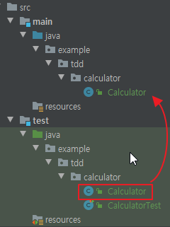

# TDD란

구현을 먼저 하고 나중에 테스트를 하지 않는다.
테스트를 하고 구현을 한다.
테스트 코드를 작성함으로써 기능이 올바르게 작동하는지 확인할 수 있다.
또한 구현 관점이 아닌 사용자 관점에서 클래스를 설계할 수 있도록 도와준다.

#### 1. 계산기 클래스 작성

테스트 코트를 통한 기능 구현은 처음부터 많은 기능을 구현하는 것이 아니다.
점진적으로 테스트를 통과할 만큼만 작성하여 기능을 완성해 나가는 것이다.

###### 1.1. 계산기 클래스 테스트 케이스 01

테스트 코드를 통해 계산기의 덧셈 기능을 작성한다.

```java
public class Calculator {
    public static int plus(int a1, int a2) {
        return 0;
    }
}
```

처음에는 최대한 단순하게 계산기 클래스를 작성한다.
특별한 로직은 존재하지 않고 단순하게 0을 반환하도록 작성한다.


```java
public class CalculatorTest {

    @Test
    public void plus() {
        int result = Calculator.plus(1, 2);
        assertEquals(3, result);
    }

}
```

작성한 Calculator를 테스트하는 코드를 작성한다.
assertEquals() 메서드는 인자로 받은 두 값이 동일한지 비교한다.
해당 테스트 코드를 실행하면 결과는 아래와 같다.

```text
java.lang.AssertionError:

Expected :3
Actual   :0
```

당연한 결과이다.
현재 Calculator의 plus() 메서드는 0을 반환하므로 3과 같을 수 없다.
여기서 테스트 코드를 보며 여러 의문점을 갖는다.

- 계산기 클래스의 이름으로 Calculator가 적절한가?
- 계산기 클래스의 덧셈 메서드의 이름으로 plus가 적절한가?
    - sum(), add() 등 더한다는 의미는 다른 이름도 존재한다.
- 덧셈 기능의 메서드의 파라미터는 몇개가 적절할까? 파라미터의 타입은 ? 메서드의 반환 값은 ?
- 덧셈 메서드를 정적 메서드와 인스턴스 메서드 중에 무엇으로 구현할까?

테스트 코드를 작성하며 클래스에 대한 설계에 대해 여러 의문점을 갖게 된다.
이는 클래스를 사용하는 사용자 입장에 대해 더욱 깊이 이해할 수 있는 시간이다.

###### 1.2. 계산기 클래스 테스트 케이스 02

```java
public class Calculator {
    public static int plus(int a1, int a2) {
        return 3;
    }
}
```

Calculator의 plus()의 내용을 변경하였다.
첫번째 테스트 코드가 3과 같아야 한다.
그러므로 해당 테스트를 통과하기 위한 만큼만 코드를 변경했다.

```java
public class CalculatorTest {

    @Test
    public void plus_expect_3() {
        int result = Calculator.plus(1, 2);
        assertEquals(3, result);
    }

    @Test
    public void plus_expect_5() {
        int result = Calculator.plus(2, 3);
        assertEquals(5, result);
    }

}
```

2와 3을 더해서 5가 나오는지에 대한 테스트 코드를 추가했다.
아래는 실행 결과이다.


```text
java.lang.AssertionError:
 
Expected :5
Actual   :3
```

이번에는 3을 예상했던 테스트 코드는 성공하였으나 5를 예상한 테스트 코드는 실패했다.
당연하게도 3을 반환하기 때문이다.
첫번째 3을 비교하는 테스트를 통과하기 위해 코드를 변경하였으나 조건이 5로 변경하니 실패하였다.

###### 1.3. 계산기 클래스 테스트 케이스 03

```java
public class Calculator {
    public static int plus(int a1, int a2) {
        return a1 + a2;
    }
}
```

Calculator 클래스를 수정했다.
다시 테스트 클래스를 실행한다.
아래는 실행 결과이다.

```text
Process finished with exit code 0
```

###### 1.4. 테스트 코드 이동



테스트를 통해 완성된 클래스는 소스 폴더로 이동시켜 배포 대상에 포함한다.
코드 위치를 이동한 뒤에 CalculatorTest 클래스를 통해 테스트에 통과하는지 다시 확인한다.

#### 2. 정리

###### 2.1. 테스트 대상 클래스에 대한 고민

Calculator 테스트 코드를 작성하면서 아래와 같은 여러가지 의문이 생겼다.

- 테스트 대상이 될 클래스의 이름
- 메서드 이름
- 파라미터 개수
- 리턴 타입 
- 객체를 새로 생성 or 정적 메서드로 구현

이런 고민 과정은 실제 코드를 설계하는 과정과 유사하다.

###### 2.2. 점진적 완성

일단 테스트 코드를 작성한다.
그리고 테스트를 통과할 만큼만 코드를 구현한다.
만약 실패한다면 해당 테스트를 통과시킬 정도로만 구현한다.
그리고 이를 계속 반복한다.
이렇게 테스트를 통과시킬 만큼 코드를 추가하는 과정을 반복하면서 점진적으로 기능을 완성한다.

